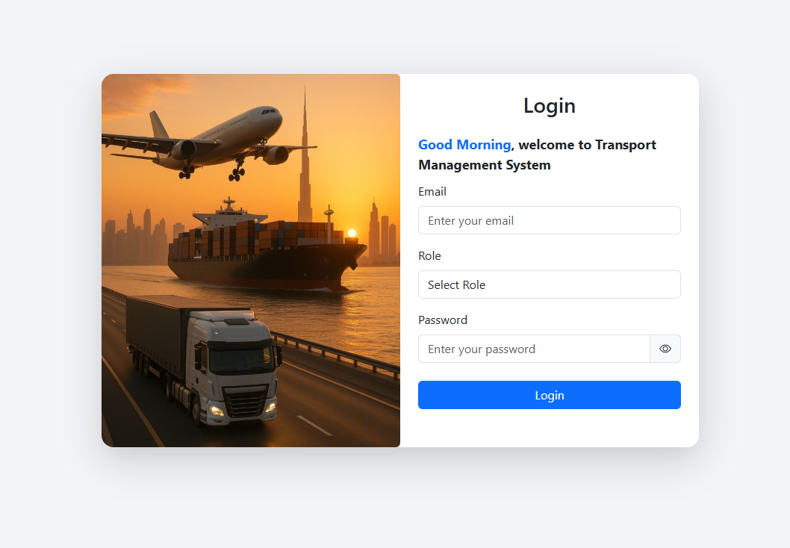

# Transport Management System (Demo Project)

## Overview
This is a **web-based Transport Management System** designed to manage a large fleet of vehicles (500+) and drivers (600+).  
The internal manual system was prone to **human errors**, so this project automates vehicle, driver, and trip management to reduce mistakes and improve operational efficiency.  

This project is a **demo version** of an internal office application, showcasing a professional MERN stack implementation.

---

## Features

### Admin Panel
- Dashboard with data visualizations (fleet status, trips, and drivers)
- Vehicle Management: Add new vehicles, view vehicle details
- Driver Management: Add new drivers, view driver profiles
- User Management: Role-based access control (Admin, Dispatcher, Driver)
- Role-specific access ensures only authorized users can view certain data

### Dispatcher Panel
- Dashboard with visualization of trips and vehicles
- Trip Scheduling & Management
- View available drivers and vehicles
- Trip history and maintenance tracking

### Driver Panel
- View personal trip history and assignments
- Access limited to the authenticated driver

### Core Functionalities
- Role-based authentication and access control
- Interactive map directions using **Mapbox API**
- Form validation using **Formik & Yup**
- API calls handled with **Axios**
- Page navigation using **React Router**
- State management with **Redux-Saga**

---

### Key Highlights

Role-based access control: Only authorized users can access specific panels

Real-time data visualization: Admin and dispatcher dashboards show fleet status

Scalable architecture: Clean separation of frontend and backend for maintainability

Professional stack: React, Redux-Saga, Node.js, Express, MongoDB

## Tech Stack

### Frontend
- React.js  
- Redux-Saga  
- React Router  
- Bootstrap
- Axios  
- Formik & Yup  
- Mapbox API  

### Backend
- Node.js + Express.js  
- MongoDB (NoSQL)  
- Mongoose (ODM)  
- Multer (File Uploads)  
- dotenv (Environment Variables)  
- Nodemon (Development)

### Project Screeshot Image



## Installation & Running Locally

### Clone the repository
```bash
git clone https://github.com/yourusername/transport-management-demo.git
cd transport-management-demo

##Frontend
cd frontend
npm install
npm start

##Backend
cd backend
npm install
npm run dev


## Notes

This is a demo project based on an internal system.

Some sensitive information and company-specific data are removed.

The project is not fully responsive ,it is optimized for desktop usage.
